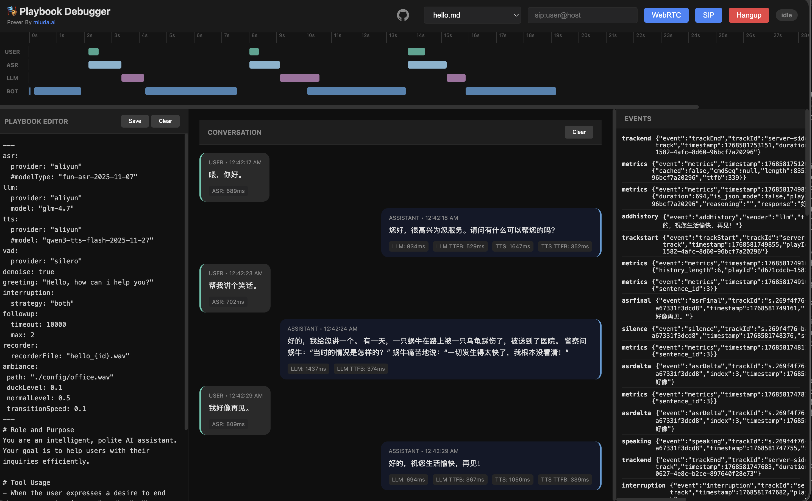

# Active Call

`active-call` is a standalone Rust crate designed for building AI Voice Agents. It provides a high-performance infrastructure for bridging AI models with real-word telephony and web communications.

## 📖 Documentation

For comprehensive guides and tutorials, visit:

- **[Documentation Hub](./docs/README.md)** - Complete documentation index
- **[Configuration Guide](./docs/config_guide.en.md)** - Detailed configuration for all call scenarios
- **[配置指南（中文）](./docs/config_guide.zh.md)** - 完整的中文配置指南
- **[API Documentation](./docs/api.md)** - WebSocket API reference
- **[Playbook Tutorial](./docs/playbook_tutorial.en.md)** - Building stateful voice agents

## Key Capabilities

### 1. Multi-Protocol Audio Gateway

`active-call` supports a wide range of communication protocols, ensuring compatibility with both legacy and modern systems:

- **SIP (Telephony)**: Supports standard SIP signaling. Can act as a **SIP Client/Extension** to register with PBX systems like **[RustPBX](https://github.com/restsend/rustpbx)**, **FreeSWITCH** or **Asterisk**, or handle direct SIP incoming/outgoing calls.
- **WebRTC**: Direct browser-to-agent communication with low-latency SRTP. (Note: WebRTC requires a secure context. You must use **HTTPS** or **127.0.0.1** to access your web client).
- **Voice over WebSocket**: A highly flexible API for custom integrations. Push raw PCM/encoded audio over WebSocket and receive real-time events.

### 2. Dual-Engine Dialogue Support

Choose the pipeline that fits your latency and cost requirements:

- **Traditional Serial Pipeline**: Integrated **VAD → ASR → LLM → TTS** flow. Supports various providers (OpenAI, Aliyun, Azure, Tencent) with optimized buffering and endpoints.
- **Realtime Streaming Pipeline**: Native support for **OpenAI/Azure Realtime API**. True full-duplex conversational AI with ultra-low latency, server-side VAD, and emotional nuance.

### 3. Playbook: The Best Practice for Dialogue

The **Playbook** system is our recommended way to build complex, stateful voice agents:

- **Markdown-Driven**: Define personas, instructions, and flows in readable Markdown files.
- **Stateful Scenes**: Manage conversation stages with easy transitions (`Scene` switching).
- **Tool Integration**: Built-in support for DTMF, SIP Refer (Transfer), and custom Function Calling.
- **Advanced Interaction**: Smart interruptions, filler word filtering, background ambiance, and automated post-call summaries via Webhooks.

### 4. Advanced Context Management (NEW)

Enhance conversational fluidity with intelligent context handling:

- **Context Repair**: Automatically detects and fixes fragmentation caused by pauses (e.g., users finishing sentences after an interruption).
- **Rolling Summary**: Manages long conversations by periodically summarizing history to maintain context without hitting token limits.

### 5. High-Performance Media Core

- **Low-Latency VAD**: Includes **TinySilero** (optimized Rust implementation), significantly faster than standard ONNX models.
- **Flexible Processing Chain**: Easily add noise reduction, echo cancellation, or custom audio processors.
- **Codec Support**: PCM16, G.711 (PCMU/PCMA), G.722, and Opus.

### 6. Offline AI Capabilities (NEW)

**Privacy-First & Cost-Effective**: Run ASR and TTS locally without cloud APIs

- **Offline ASR**: [SenseVoice](https://github.com/FunAudioLLM/SenseVoice) multi-language speech recognition (Chinese, English, Japanese, Korean, Cantonese).
- **Offline TTS**: [Supertonic](https://github.com/supertone-inc/supertonic) high-quality multi-lingual text-to-speech (English, Korean, Spanish, Portuguese, French). Default for English (en). For Chinese (zh), MsEdge TTS is used by default for TEST.
- **Zero Latency Penalty**: Global singleton ONNX sessions shared across all calls
- **Easy Setup**: One-command model download from HuggingFace
- **No API Keys**: Perfect for on-premise deployments and GDPR compliance

#### Quick Start with Offline Models

We recommend using Docker to run `active-call` with offline models. The easiest way is to download the models first using a temporary container.

⚠️ Docker must have access to the internet to download models from HuggingFace.
⚠️ Docker must run with `--net host` on OS to ensure proper SIP/RTP functionality.

**1. Download Models**

```bash
# Create a local directory for models
mkdir -p $(pwd)/data/models

# Download all models (SenseVoice & Supertonic)
docker run --rm \
  -v $(pwd)/data/models:/models \
  ghcr.io/restsend/active-call:latest \
  --download-models all --models-dir /models \
   --exit-after-download
```

> **Note for users in Mainland China**:
> If you experience slow downloads from HuggingFace, you can use the mirror site by setting the `HF_ENDPOINT` environment variable:
>
> ```bash
> docker run --rm \
>   -e HF_ENDPOINT=https://hf-mirror.com \
>   -v $(pwd)/data/models:/models \
>   ghcr.io/restsend/active-call:latest \
>   --download-models all --models-dir /models
> ```

**2. Run with Models Mounted**

Once downloaded, mount the models directory when running the service:

```bash
docker run -d \
  --net host \
  -p 8080:8080 \
  -p 13050:13050/udp \
  -v $(pwd)/data/models:/app/models \
  -v $(pwd)/config:/app/config \
  ghcr.io/restsend/active-call:latest
```

#### Configuration

```yaml
# In your playbook .md file
---
asr:
  provider: "sensevoice"  # Offline ASR
  language: "zh"          # auto, zh, en, ja, ko, yue
  
tts:
  provider: "supertonic"  # Offline TTS
  speaker: "M1"           # M1, M2, F1, F2
  speed: 1.0
  language: "en"          # en, ko, es, pt, fr
  
vad:
  provider: "silero"      # Uses built-in TinySilero
---
```

**Benefits:**

- 🔒 **Privacy**: All audio processing happens locally
- 💰 **Cost**: No per-minute API charges
- 🚀 **Performance**: Single model instance shared across calls
- 🌍 **Offline**: Works without internet connection
- 📦 **Self-Contained**: ~500MB model files, no external dependencies

## Protocol Flexibility

### Voice over WebSocket

For developers who need full control, `active-call` provides a raw audio-over-websocket interface. This is ideal for custom web apps or integration with existing AI pipelines where you want to handle the audio stream manually.

### SIP PBX Integration

`active-call` can be integrated into existing corporate telephony:

- **As an Extension**: Register `active-call` to your [RustPBX](https://github.com/restsend/rustpbx), FreeSWITCH or Asterisk PBX like any other VoIP phone. AI agents can then receive calls from internal extensions or external trunks.
- **As a Trunk**: Handle incoming SIP traffic directly from carriers.

### SIP Invitation Handlers

`active-call` provides flexible handling of incoming SIP invitations through configurable handlers:

#### Quick CLI Configuration

For rapid setup without editing config files, use CLI parameters:

```bash
# Webhook handler
./active-call --handler https://example.com/webhook

# Playbook handler (default playbook)
./active-call --handler default.md

# Make an outgoing SIP call using a playbook
./active-call --call sip:1001@127.0.0.1:5060 --handler greeting.md

# Set external IP and supported codecs
./active-call --handler default.md --external-ip 1.2.3.4 --codecs pcmu,pcma,opus
```

The handler type is automatically detected:

- URLs starting with `http://` or `https://` become **Webhook handlers**
- Files ending with `.md` become **Playbook handlers** (set as default)

Additional CLI options:

- `--call <SIP_URI>`: Initiate an outgoing SIP call immediately
- `--external-ip <IP>`: Set external IP address for SIP/RTP
- `--codecs <CODECS>`: Comma-separated list of supported codecs (pcmu,pcma,g722,g729,opus,telephone_event)

#### Webhook Handler

Forward incoming SIP invitations to an HTTP endpoint for custom call routing logic:

```toml
[handler]
type = "webhook"
url = "http://localhost:8090/webhook"
method = "POST"
```

#### Playbook Handler

Automatically route calls to specific playbooks based on caller/callee patterns using regex matching:

```toml
[handler]
type = "playbook"
default = "default.md"  # Optional: fallback when no rules match

[[handler.rules]]
caller = "^\\+1\\d{10}$"        # Match US numbers
callee = "^sip:support@.*"      # Match support line
playbook = "support.md"         # Use support playbook

[[handler.rules]]
caller = "^\\+86\\d+"           # Match Chinese numbers
playbook = "chinese.md"         # Language-specific playbook

[[handler.rules]]
callee = "^sip:sales@.*"        # Match sales line
playbook = "sales.md"           # Use sales playbook
```

**How it works:**

- Rules are evaluated in order from top to bottom
- Each rule can specify `caller` and/or `callee` regex patterns
- Both patterns must match for the rule to apply (omitted patterns match any value)
- The first matching rule determines which playbook to use
- If no rules match and no default is set, the call is rejected
- Playbook files should be placed in the `config/playbook/` directory

**Use cases:**

- Route calls from different regions to language-specific agents
- Direct calls to different departments based on the dialed number
- Provide specialized handling for VIP customers based on caller ID
- Implement time-based routing with multiple handler configurations

### SIP Call with Playbook Example

Here's a complete example of setting up `active-call` to handle incoming SIP calls with playbooks:

#### 1. Create a Playbook File

Create `config/playbook/greeting.md`:

```markdown
---
asr:
  provider: "sensevoice"
tts:
  provider: "supertonic"
  speaker: "F1"
llm:
  provider: "openai"
  model: "gpt-4o-mini"
---

# Scene: greeting

You are a friendly AI assistant. Greet the caller warmly and ask how you can help them today.
```

#### 2. Configure the Handler

Option A: Using CLI (Quick Start):

```bash
# Start with playbook handler
./active-call --handler config/playbook/greeting.md --sip 0.0.0.0:5060 --external-ip your-server-ip
```

Option B: Using Configuration File (`config.toml`):

```toml
[handler]
type = "playbook"
default = "greeting.md"

# Optional: Add routing rules
[[handler.rules]]
callee = "^sip:sales@.*"
playbook = "sales.md"

[[handler.rules]]
callee = "^sip:support@.*"
playbook = "support.md"
```

#### 3. Make a SIP Call

Using any SIP client (like linphone, zoiper, or sipbot):

```bash
# Using pjsua (PJSIP command line tool)
pjsua --use-ice --null-audio sip:agent@your-server-ip:5060

# Or using sipbot (for testing)
sipbot -target sip:agent@your-server-ip:5060 -duration 30
```

#### 4. What Happens

1. `active-call` receives the SIP INVITE
2. Playbook handler matches the call (by rules or default)
3. Validates that the playbook file exists
4. Accepts the SIP call and establishes RTP media
5. Loads and runs the playbook
6. AI agent converses with the caller
7. Call ends when either party hangs up

#### 5. Monitoring

Check logs to see the call flow:

```bash
RUST_LOG=info ./active-call --handler greeting.md

# You'll see:
# INFO active_call::useragent::playbook_handler: matched playbook for invite
# INFO active_call::handler::handler: Playbook runner started for greeting.md
# INFO active_call::handler::handler: new call started
```

#### Error Handling

If the playbook file doesn't exist:

- The handler validates the file before accepting the SIP call
- Sends `503 Service Unavailable` response to the caller
- Logs: `Playbook file not found, rejecting SIP call`

This prevents accepting calls that can't be properly handled.

## Playbook Demo



## VAD Performance

Benchmarked on 60 seconds of 16kHz audio (Release mode):

| VAD Engine      | Implementation   | Time (60s) | RTF (Ratio) | Note                   |
| --------------- | ---------------- | ---------- | ----------- | ---------------------- |
| **TinySilero**  | Rust (Optimized) | ~60.0 ms   | 0.0010      | >2.5x faster than ONNX |
| **ONNX Silero** | ONNX Runtime     | ~158.3 ms  | 0.0026      | Standard baseline      |
| **WebRTC VAD**  | C/C++ (Bind)     | ~3.1 ms    | 0.00005     | Legacy, less accurate  |

## API Documentation

For detailed information on REST endpoints and WebSocket protocols, please refer to the [API Documentation](docs/api.md).

## SDKs

- **Go SDK**: [rustpbxgo](https://github.com/restsend/rustpbxgo) - Official Go client for building voice applications with `active-call`.

## Dialogue Features

`active-call` provides a rich set of features for building natural and responsive voice agents:

- **Scene Management (Playbook)**:
  - **Markdown-based configuration**: Define agent behavior using simple Markdown files.
  - **Multiple Scenes**: Split long conversations into manageable stages (Scenes) using `# Scene: name` headers.
  - **Dynamic Variables**: Supports `{{ variable }}` syntax using [minijinja](https://github.com/mitsuhiko/minijinja) for personalized prompts.
  - **LLM Integration**: Streaming responses with configurable prompts and tool-like tags.
  - **Background Ambiance**: Supports looping background audio (e.g., office noise) with auto-ducking during conversation.
  - **Follow-up**: Automatically follow up with the user after a period of silence (e.g., "Are you still there?").
  - **DTMF Support**: Standard IVR functionality. Define global or scene-specific keypress actions (jump to scene, transfer call, or hang up).
  - **Pre-recorded Audio**: Play fixed audio files (`.wav`/`.pcm`) by adding `<play file="path/to/audio.wav" />` at the beginning of a scene.
  - **Post-hook & Summary**: Automatically generate conversation summaries and send them to a Webhook URL after the call ends. Supports multiple summary templates:
    - `short`: One or two sentence summary.
    - `detailed`: Comprehensive summary with key points and decisions.
    - `intent`: Extracted user intent.
    - `json`: Structured JSON summary.
    - `custom`: Fully custom summary prompt.
  - **Built-in Feature Snippets**: Enhances agent capabilities with ready-to-use, multi-language prompt snippets. Support includes:
    - `intent_clarification`: Automatically guides the LLM to ask for clarification when user intent is ambiguous.
    - `emotion_resonance`: Enables the LLM to sense and respond to user emotions (anger, joy, etc.) with empathy.
    - `voice_emotion`: Instructs the LLM to generate emotion tags (e.g., `[happy]`) to drive expressive TTS.
    - **Multi-language**: Snippets are automatically translated based on the `language` setting (`zh` or `en`).

- **Advanced Voice Interaction**:
  - **Smart Interruption**: Multiple strategies (`vad`, `asr`, or `both`), filler word filtering, and protection periods.
  - **Graceful Interruption**: Supports audio fade-out instead of hard cuts when the user starts speaking.
  - **EOU (End of Utterance) Optimization**: Starts LLM inference as soon as silence is detected, before ASR final results are ready.

## Playbook Configuration

Playbooks are defined in Markdown files with YAML frontmatter. The frontmatter configures the voice capabilities, while the body defines the agent's persona and instructions.

### Example

```markdown
---

asr:
  provider: "sensevoice"
tts:
  provider: "supertonic"
  speaker: "F1"
llm:
  provider: "openai"
  model: "gpt-4-turbo"
  language: "zh"
  features: ["intent_clarification", "emotion_resonance"]
dtmf:
  "0": { action: "hangup" }
followup:
  timeout: 10000
  max: 3
posthook:
  url: "https://api.example.com/webhook"
  summary: "detailed"
  includeHistory: true
---

# Scene: greeting
<dtmf digit="1" action="goto" scene="tech_support" />

You are a friendly AI for {{ company_name }}. 
Greet the caller and ask if they need technical support (Press 1) or billing help.

# Scene: tech_support
You are now in tech support. How can I help with your system?
To speak to a human, I can transfer you: <refer to="sip:human@domain.com" />
```

### Configuration Reference

| Section          | Field              | Description                                                                           |
| ---------------- | ------------------ | ------------------------------------------------------------------------------------- |
| **asr**          | `provider`         | Provider name (e.g., `aliyun`, `openai`, `tencent`).                                  |
| **tts**          | `provider`         | Provider name.                                                                        |
| **llm**          | `provider`         | LLM Provider.                                                                         |
|                  | `model`            | Model name (e.g., `gpt-4`, `qwen-plus`).                                              |
|                  | `language`         | Language code for built-in snippets (`zh` or `en`).                                   |
|                  | `features`         | List of enabled feature snippets (e.g., `["intent_clarification", "voice_emotion"]`). |
| **dtmf**         | `digit`            | Mapping of keys (0-9, *, #) to actions.                                               |
|                  | `action`           | `goto` (scene), `transfer` (SIP), or `hangup`.                                        |
| **interruption** | `strategy`         | `both`, `vad`, `asr`, or `none`.                                                      |
|                  | `fillerWordFilter` | Enable filler word filtering (true/false).                                            |
| **vad**          | `provider`         | VAD provider (e.g., `silero`).                                                        |
| **realtime**     | `provider`         | `openai` or `azure`. Enable low-latency streaming pipeline.                           |
|                  | `model`            | Specific realtime model (e.g., `gpt-4o-realtime`).                                    |
| **ambiance**     | `path`             | Path to background audio file.                                                        |
|                  | `duckLevel`        | Volume level when agent is speaking (0.0-1.0).                                        |
| **followup**     | `timeout`          | Silence timeout in ms before triggering follow-up.                                    |
|                  | `max`              | Maximum number of follow-up attempts.                                                 |
| **recorder**     | `recorderFile`     | Path template for recording (e.g., `call_{id}.wav`).                                  |
| **denoise**      | -                  | Enable/Disable noise suppression (true/false).                                        |
| **greeting**     | -                  | Initial greeting message.                                                             |

## Docker Usage

### Pull the Image

```bash
docker pull ghcr.io/restsend/active-call:latest
```

### Configuration

Copy the example config and customize it:

```bash
cp active-call.example.toml config.toml
```

### Run with Docker

```bash
docker run -d \
  --net host \
  --name active-call \
  -v $(pwd)/config.toml:/app/config.toml:ro \
  -v $(pwd)/config:/app/config \
  -v $(pwd)/models:/app/models \
  ghcr.io/restsend/active-call:latest
```

### CLI Options

You can override configuration with CLI parameters:

```bash
docker run -d \
  --net host \
  --name active-call \
  -p 13050:13050/udp \
  -v $(pwd)/config:/app/config \
  ghcr.io/restsend/active-call:latest \
  --handler https://api.example.com/webhook
```

Supported CLI options:

- `--conf <path>`: Path to config file
- `--http <addr:port>`: HTTP server address
- `--sip <addr:port>`: SIP server address
- `--handler <url|file.md>`: Quick handler setup (webhook URL or playbook file)

### Environment Variables

Active-call supports various environment variables for configuration. If you have API keys or credentials, save them in an `.env` file:

#### Cloud Provider Credentials

```bash
# OpenAI/Azure OpenAI
OPENAI_API_KEY=sk-...
AZURE_OPENAI_API_KEY=your_azure_key
AZURE_OPENAI_ENDPOINT=https://your-resource.openai.azure.com/

# Aliyun (DashScope)
DASHSCOPE_API_KEY=sk-...

# Tencent Cloud
TENCENT_APPID=your_app_id
TENCENT_SECRET_ID=your_secret_id
TENCENT_SECRET_KEY=your_secret_key
```

#### LLM Provider Defaults

When `llm.provider` is specified in playbooks, active-call automatically reads default API keys from environment:

- **openai**: Reads `OPENAI_API_KEY`
- **azure**: Reads `AZURE_OPENAI_API_KEY` and `AZURE_OPENAI_ENDPOINT`
- **dashscope** (Aliyun): Reads `DASHSCOPE_API_KEY`
- **tencent**: Reads `TENCENT_APPID`, `TENCENT_SECRET_ID`, `TENCENT_SECRET_KEY`

#### Offline Model Configuration

```bash
# Model directory (default: ./models)
OFFLINE_MODELS_DIR=/path/to/models

# HuggingFace Hub settings (optional)
HF_ENDPOINT=https://hf-mirror.com  # Use mirror if needed
HF_MIRROR=https://hf-mirror.com
```

#### Docker Usage

Mount your `.env` file when running containers:

```bash
docker run -d \
  --net host \
  --name active-call \
  -v $(pwd)/.env:/app/.env \
  -v $(pwd)/config:/app/config \
  -v $(pwd)/models:/app/models \
  active-call:latest
```

## License

This project is licensed under the MIT License.
