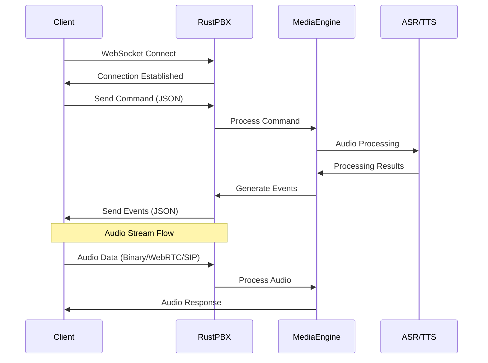
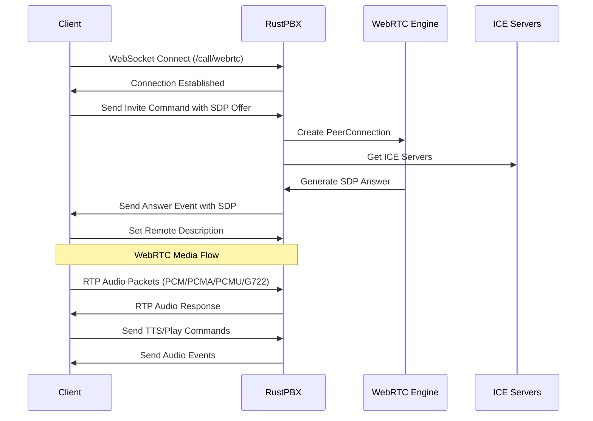
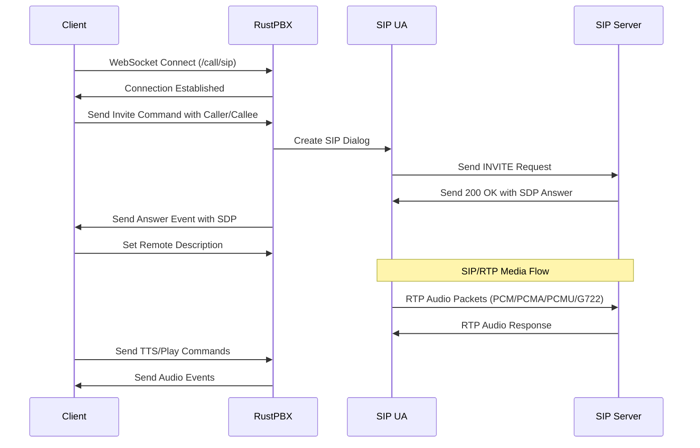
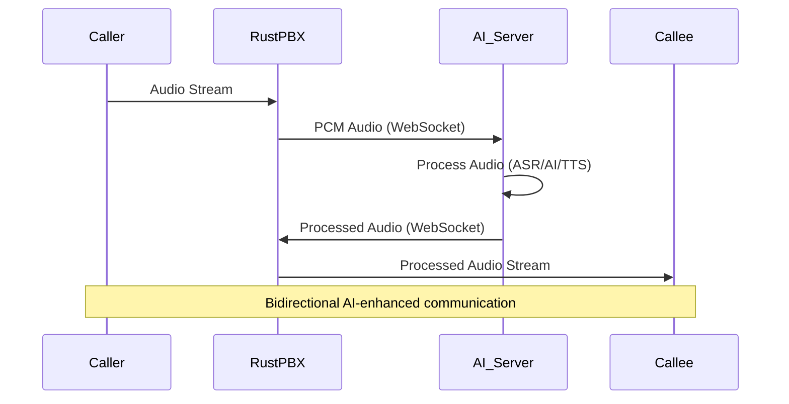

# RustPBX API Documentation

This document describes the REST API endpoints provided by RustPBX.

## Base URL

All API endpoints are relative to the server base URL.

## Authentication

Most endpoints require WebSocket upgrade for real-time communication.

## WebSocket Call Endpoints

The following three endpoints establish WebSocket connections for different voice communication protocols:

### 1. WebSocket Call Handler

**Endpoint:** `GET /call`

**Description:** Establishes a WebSocket connection for voice call handling with audio stream transmitted via WebSocket.

**Parameters:**
- `id` (optional, string): Session ID. If not provided, a new UUID will be generated.
- `dump` (optional, boolean): Enable event dumping. Default: `true`.

**Response:** WebSocket connection upgrade

**Usage:**
```javascript
const ws = new WebSocket('ws://localhost:8080/call?id=session123&dump=true');
```

### 2. WebRTC Call Handler

**Endpoint:** `GET /call/webrtc`

**Description:** Establishes a WebSocket connection for WebRTC call handling with audio stream transmitted via WebRTC RTP.

> **Note**: WebRTC requires a Secure Context. Ensure you are accessing your web client via **HTTPS** or **127.0.0.1**, otherwise the browser will not enable WebRTC functionality.

**Parameters:**
- `id` (optional, string): Session ID. If not provided, a new UUID will be generated.
- `dump` (optional, boolean): Enable event dumping. Default: `true`.

**Response:** WebSocket connection upgrade

**Usage:**
```javascript
const ws = new WebSocket('ws://localhost:8080/call/webrtc?id=session123&dump=true');
```

### 3. SIP Call Handler

**Endpoint:** `GET /call/sip`

**Description:** Establishes a WebSocket connection for SIP call handling with audio stream transmitted via SIP/RTP.

**Parameters:**
- `id` (optional, string): Session ID. If not provided, a new UUID will be generated.
- `dump` (optional, boolean): Enable event dumping. Default: `true`.

**Response:** WebSocket connection upgrade

**Usage:**
```javascript
const ws = new WebSocket('ws://localhost:8080/call/sip?id=session123&dump=true');
```

## WebSocket Communication Flow



## WebRTC Call Flow



## SIP Call Flow



## Voice Stream Communication Methods

### 1. WebSocket Audio Stream (`/call`)
- **Audio Format:** PCM, PCMA, PCMU, G722
- **Transport:** WebSocket binary messages
- **Usage:** Direct audio streaming over WebSocket connection
- **Advantages:** Simple, low latency, works through firewalls

### 2. WebRTC Audio Stream (`/call/webrtc`)
- **Audio Format:** PCM, PCMA, PCMU, G722
- **Transport:** WebRTC RTP over UDP
- **Usage:** Browser-compatible, NAT traversal
- **Advantages:** Browser native support, adaptive bitrate

### 3. SIP Audio Stream (`/call/sip`)
- **Audio Format:** PCM, PCMA, PCMU, G722
- **Transport:** SIP/RTP over UDP
- **Usage:** Traditional telephony integration
- **Advantages:** Standard telephony protocol, PBX integration

## MediaPass Feature

MediaPass allows for bidirectional audio streaming between RustPBX and an external WebSocket server. This feature enables another side to receive and send audio streams during a call.

### MediaPass Configuration

The `mediaPass` option in `CallOption` configures the WebSocket connection for audio streaming:

```json
{
  "mediaPass": {
    "url": "ws://localhost:9090/media",
    "inputSampleRate": 16000,
    "outputSampleRate": 16000,
    "packetSize": 2560
  }
}
```

**MediaPass Fields:**
- `url` (string): WebSocket URL to connect to for media streaming
- `inputSampleRate` (number): Sample rate of audio received from the WebSocket server (also the sample rate of the track)
- `outputSampleRate` (number): Sample rate of audio sent to the WebSocket server
- `packetSize` (number, optional): Packet size sent to WebSocket server, default is 2560 bytes
- `ptime` (numer, optional): if ptime is set, server will buffering the input audio, and playing it with `ptime` period


### MediaPass Example Usage

#### Example 1: Basic MediaPass Setup

```json
{
  "command": "invite",
  "option": {
    "caller": "sip:alice@rustpbx.com",
    "callee": "sip:bob@rustpbx.com",
    "codec": "g722",
    "mediaPass": {
      "url": "ws://ai-server.rustpbx.com:9090/audio",
      "inputSampleRate": 16000,
      "outputSampleRate": 16000,
      "packetSize": 1280
    },
    "asr": {
      "provider": "tencent",
      "language": "zh-CN",
      "secretId": "your_secret_id",
      "secretKey": "your_secret_key",
      "modelType": "16k_zh",
      "samplerate": 16000
    }
  }
}
```

#### Example 2: MediaPass with AI Voice Processing

```json
{
  "command": "accept",
  "option": {
    "caller": "sip:caller@rustpbx.com",
    "callee": "sip:agent@rustpbx.com",
    "codec": "pcmu",
    "denoise": true,
    "mediaPass": {
      "url": "ws://ai-voice-processor.rustpbx.com:8090/stream",
      "inputSampleRate": 8000,
      "outputSampleRate": 16000,
      "packetSize": 2560
    },
    "vad": {
      "type": "webrtc",
      "samplerate": 16000,
      "speechPadding": 250,
      "silencePadding": 100,
      "voiceThreshold": 0.5
    },
    "recorder": {
      "recorderFile": "/recordings/call_with_ai.wav",
      "samplerate": 16000,
      "ptime": 200
    }
  }
}
```

### MediaPass WebSocket Protocol

The external WebSocket server should handle binary audio data in PCM format:

1. **Receiving Audio:** RustPBX sends PCM audio data as binary WebSocket messages at the configured `outputSampleRate`
2. **Sending Audio:** The WebSocket server can send PCM audio data back to RustPBX at the configured `inputSampleRate`
3. **Audio Format:** Raw PCM data, signed 16-bit little-endian
4. **Packet Size:** Configurable via `packetSize` parameter (default: 2560 bytes)

### MediaPass Flow Diagram



## WebSocket Commands

Commands are sent as JSON messages through the WebSocket connection. All timestamps are in milliseconds. Each command follows a common structure with the `command` field indicating the operation type.

### Core Call Management Commands

#### Invite Command
**Purpose:** Initiates a new outbound call.

**Fields:**
- `command` (string): Always "invite"
- `option` (CallOption): Call configuration parameters

```json
{
  "command": "invite",
  "option": {
    "caller": "sip:alice@rustpbx.com",
    "callee": "sip:bob@rustpbx.com",
    "offer": "v=0\r\no=- 1234567890 2 IN IP4 127.0.0.1\r\n...",
    "codec": "g722",
    "denoise": true,
    "asr": {
      "provider": "tencent",
      "language": "zh-CN",
      "appId": "app_id",
      "secretId": "your_secret_id",
      "secretKey": "your_secret_key",
      "modelType": "16k_zh",
      "samplerate": 16000,
      "startWhenAnswer": true
    },
    "tts": {
      "provider": "tencent",
      "speaker": "xiaoyan",
      "volume": 5,
      "speed": 1.0,
      "emotion": "neutral"
    }
  }
}
```

#### Accept Command
**Purpose:** Accepts an incoming call.

**Fields:**
- `command` (string): Always "accept"
- `option` (CallOption): Call configuration parameters

```json
{
  "command": "accept",
  "option": {
    "caller": "sip:alice@rustpbx.com",
    "callee": "sip:bob@rustpbx.com",
    "codec": "g722",
    "recorder": {
      "recorderFile": "/path/to/recording.wav",
      "samplerate": 16000,
      "ptime": 200
    }
  }
}
```

#### Reject Command
**Purpose:** Rejects an incoming call.

**Fields:**
- `command` (string): Always "reject"
- `reason` (string): Reason for rejection
- `code` (number, optional): SIP response code

```json
{
  "command": "reject",
  "reason": "Busy",
  "code": 486
}
```

#### Ringing Command
**Purpose:** Sends ringing response for incoming call.
> **Note:** If a `recorder` is set in the ringing command, the `recorder` option in the subsequent accept command will **not** override the recorder settings from the ringing phase.
> 
**Fields:**
- `command` (string): Always "ringing"
- `recorder` (RecorderOption, optional): Call recording configuration
  - `recorderFile` (string): Path to the recording file
  - `samplerate` (number): Recording sample rate in Hz (default: 16000)
  - `ptime` (number): Packet time in milliseconds (default: 200)
- `earlyMedia` (boolean): Enable early media during ringing
- `ringtone` (string, optional): Custom ringtone URL

```json
{
  "command": "ringing",
  "recorder": {
      "recorderFile": "/path/to/recording.wav",
      "samplerate": 16000,
      "ptime": 200
  },
  "earlyMedia": true,
  "ringtone": "http://rustpbx.com/ringtone.wav"
}
```

### Media Control Commands

#### TTS Command
**Purpose:** Converts text to speech and plays audio.

**Fields:**
- `command` (string): Always "tts"
- `text` (string): Text to synthesize
- `speaker` (string, optional): Speaker voice name
- `playId` (string, optional): **Unique identifier for this TTS session. If the same playId is used, it will not interrupt the previous playback.**
- `autoHangup` (boolean, optional): **If true, the call will be automatically hung up after TTS playback is finished.**
- `streaming` (boolean, optional): **If true, indicates streaming text input (like LLM streaming output).**
- `endOfStream` (boolean, optional): **If true, indicates the input text is finished (used with streaming).**
- `waitInputTimeout` (number, optional): Maximum time to wait for user input in seconds
- `option` (SynthesisOption, optional): TTS provider specific options
- `base64` (bool, optional): If true, text is base64 encoded PCM samples of sample rate 16000 hz, **DO NOT use this feature in Streaming TTS**
```json
{
  "command": "tts",
  "text": "Hello, this is a test message",
  "speaker": "xiaoyan",
  "playId": "unique_play_id",
  "autoHangup": false,
  "streaming": false,
  "endOfStream": false,
  "waitInputTimeout": 30,
  "option": {
    "provider": "tencent",
    "speaker": "xiaoyan",
    "volume": 5,
    "speed": 1.0
  }
}
```

#### Play Command
**Purpose:** Plays audio from a URL.

**Fields:**
- `command` (string): Always "play"
- `url` (string): **URL of audio file to play (supports HTTP/HTTPS URLs). This URL will be returned as playId in the trackEnd event.**
- `autoHangup` (boolean, optional): **If true, the call will be automatically hung up after playback is finished.**
- `waitInputTimeout` (number, optional): Maximum time to wait for user input in seconds

```json
{
  "command": "play",
  "url": "http://rustpbx.com/audio.mp3",
  "autoHangup": false,
  "waitInputTimeout": 30
}
```

#### Interrupt Command
**Purpose:** Interrupts current TTS or audio playback.
- `graceful`: (boolean, optional), if it is true, tts track will wait until playing tts command complete.
```json
{
  "command": "interrupt",
  "graceful": "false"
}
```

#### Pause Command
**Purpose:** Pauses current playback.

```json
{
  "command": "pause"
}
```

#### Resume Command
**Purpose:** Resumes paused playback.

```json
{
  "command": "resume"
}
```

### Call Transfer Commands

#### Refer Command
**Purpose:** Transfers the call to another party (SIP REFER).

**Fields:**
- `command` (string): Always "refer"
- `caller` (string): Caller identity for the transfer
- `callee` (string): Address of Record (AOR) of the transfer target (e.g., sip:bob@rustpbx.com)
- `options` (ReferOption, optional): Transfer configuration
  - `denoise` (boolean, optional): Enable noise reduction
  - `timeout` (number, optional): Transfer timeout in seconds
  - `moh` (string, optional): Music on hold URL to play during transfer
  - `asr` (TranscriptionOption, optional): Automatic Speech Recognition configuration
    - `provider` (string): ASR provider (e.g., "tencent", "aliyun", "openai")
    - `secretId` (string): Provider secret ID
    - `secretKey` (string): Provider secret key
    - `region` (string, optional): Provider region
    - `model` (string, optional): ASR model to use
  - `autoHangup` (boolean, optional): Automatically hang up after transfer completion
  - `sip` (SipOption, optional): SIP configuration
    - `username` (string): SIP username
    - `password` (string): SIP password
    - `realm` (string): SIP realm/domain
    - `headers` (object, optional): Additional SIP headers

```json
{
  "command": "refer",
  "caller": "sip:alice@rustpbx.com",
  "callee": "sip:charlie@rustpbx.com",
  "options": {
    "denoise": true,
    "timeout": 30,
    "moh": "http://rustpbx.com/hold_music.wav",
    "asr": {
      "provider": "tencent",
      "language": "zh-CN",
      "appId": "app_id",
      "secretId": "your_secret_id",
      "secretKey": "your_secret_key",
      "modelType": "16k_zh",
      "bufferSize": 4000,
      "samplerate": 16000,
      "endpoint": "https://api.rustpbx.com",
      "extra": {
        "custom_param": "value"
      },
      "startWhenAnswer": true
    },
    "autoHangup": true,
    "sip": {
      "username": "transfer_user",
      "password": "transfer_password",
      "realm": "rustpbx.com",
      "headers": {
        "X-Transfer-Source": "pbx"
      }
    }
  }
}
```

### Audio Track Control Commands

#### Mute Command
**Purpose:** Mutes a specific audio track.

**Fields:**
- `command` (string): Always "mute"
- `trackId` (string, optional): Track ID to mute (if not specified, mutes all tracks)

```json
{
  "command": "mute",
  "trackId": "track-123"
}
```

#### Unmute Command
**Purpose:** Unmutes a specific audio track.

**Fields:**
- `command` (string): Always "unmute"
- `trackId` (string, optional): Track ID to unmute (if not specified, unmutes all tracks)

```json
{
  "command": "unmute",
  "trackId": "track-123"
}
```

### Session Management Commands

#### Hangup Command
**Purpose:** Ends the call.

**Fields:**
- `command` (string): Always "hangup"
- `reason` (string, optional): Reason for hanging up
- `initiator` (string, optional): Who initiated the hangup (user, system, etc.)

```json
{
  "command": "hangup",
  "reason": "user_requested",
  "initiator": "user"
}
```

#### History Command
**Purpose:** Adds a conversation history entry.

**Fields:**
- `command` (string): Always "history"
- `speaker` (string): Speaker identifier
- `text` (string): Conversation text

```json
{
  "command": "history",
  "speaker": "user",
  "text": "Hello, I need help with my account"
}
```

### CallOption Object Structure

The `CallOption` object is used in `invite` and `accept` commands and contains the following fields:

```json
{
  "denoise": true,
  "offer": "SDP offer string",
  "callee": "sip:callee@rustpbx.com",
  "caller": "sip:caller@rustpbx.com",
  "recorder": {
    "recorderFile": "/path/to/recording.wav",
    "samplerate": 16000,
    "ptime": 200
  },
  "asr": {
    "provider": "tencent",
    "language": "zh-CN",
    "appId": "app_id",
    "secretId": "your_secret_id",
    "secretKey": "your_secret_key",
    "modelType": "16k_zh",
    "bufferSize": 4000,
    "samplerate": 16000,
    "endpoint": "https://api.rustpbx.com",
    "extra": {
      "custom_param": "value"
    },
    "startWhenAnswer": true
  },
  "vad": {
    "type": "webrtc",
    "samplerate": 16000,
    "speechPadding": 250,
    "silencePadding": 100,
    "ratio": 0.5,
    "voiceThreshold": 0.5,
    "maxBufferDurationSecs": 50,
    "silenceTimeout": null,
    "endpoint": null,
    "secretKey": null,
    "secretId": null
  },
  "tts": {
    "samplerate": 16000,
    "provider": "tencent",
    "speed": 1.0,
    "appId": "app_id",
    "secretId": "your_secret_id",
    "secretKey": "your_secret_key",
    "volume": 5,
    "speaker": "1345",
    "codec": "pcm",
    "subtitle": true,
    "emotion": "neutral",
    "endpoint": "https://api.rustpbx.com",
    "extra": {
      "custom_param": "value"
    },
    "cacheKey": "cache_key_example"
  },
  "mediaPass": {
    "url": "ws://localhost:9090/media",
    "inputSampleRate": 16000,
    "outputSampleRate": 16000,
    "packetSize": 2560
  },
  "handshakeTimeout": 30,
  "enableIpv6": false,
  "inactivityTimeout": 50,
  "sip": {
    "username": "user",
    "password": "password",
    "realm": "rustpbx.com",
    "headers": {
      "X-Custom-Header": "value"
    }
  },
  "extra": {
    "custom_field": "custom_value"
  },
  "codec": "g722",
  "eou": {
    "type": "tencent",
    "endpoint": "https://api.rustpbx.com",
    "secretKey": "your_secret_key",
    "secretId": "your_secret_id",
    "timeout": 5000
  }
}
```

**CallOption Fields:**
- `denoise` (boolean, optional): Enable noise reduction for audio processing
- `offer` (string, optional): SDP offer string for WebRTC/SIP negotiation
- `callee` (string, optional): Callee's SIP URI or phone number (e.g., "sip:bob@rustpbx.com")
- `caller` (string, optional): Caller's SIP URI or phone number (e.g., "sip:alice@rustpbx.com")
- `recorder` (RecorderOption, optional): Call recording configuration
  - `recorderFile` (string): Path to the recording file
  - `samplerate` (number): Recording sample rate in Hz (default: 16000)
  - `ptime` (number): Packet time in milliseconds (default: 200)
- `asr` (TranscriptionOption, optional): Automatic Speech Recognition configuration
  - `provider` (string): ASR provider ("tencent", "aliyun", "voiceapi")
  - `language` (string, optional): Language code (e.g., "zh-CN", "en-US")
  - `appId` (string, optional): Application ID for the ASR service
  - `secretId` (string, optional): Secret ID for authentication
  - `secretKey` (string, optional): Secret key for authentication
  - `modelType` (string, optional): ASR model type (e.g., "16k_zh", "8k_en")
  - `bufferSize` (number, optional): Audio buffer size in bytes
  - `samplerate` (number, optional): Audio sample rate for ASR processing
  - `endpoint` (string, optional): Custom ASR service endpoint URL
  - `extra` (object, optional): Additional provider-specific parameters
  - `startWhenAnswer` (boolean, optional): Start ASR when call is answered
- `vad` (VADOption, optional): Voice Activity Detection configuration
  - `type` (string): VAD algorithm type ("silero")
  - `samplerate` (number): Audio sample rate for VAD processing (default: 16000)
  - `speechPadding` (number): Padding before speech detection in milliseconds (default: 250)
  - `silencePadding` (number): Padding after silence detection in milliseconds (default: 100)
  - `ratio` (number): Voice detection ratio threshold (default: 0.5)
  - `voiceThreshold` (number): Voice energy threshold (default: 0.5)
  - `maxBufferDurationSecs` (number): Maximum buffer duration in seconds (default: 50)
  - `silenceTimeout` (number, optional): Timeout for silence detection in milliseconds
  - `endpoint` (string, optional): Custom VAD service endpoint
  - `secretKey` (string, optional): Secret key for VAD service authentication
  - `secretId` (string, optional): Secret ID for VAD service authentication
- `tts` (SynthesisOption, optional): Text-to-Speech configuration
  - `samplerate` (number, optional): TTS output sample rate in Hz
  - `provider` (string, optional): TTS provider ("tencent", "aliyun", "deepgram", "supertonic"). Default: "aliyun" for Chinese (zh), "supertonic" for English (en).
  - `speed` (number, optional): Speech speed multiplier (default: 1.0)
  - `appId` (string, optional): Application ID for TTS service
  - `secretId` (string, optional): Secret ID for authentication
  - `secretKey` (string, optional): Secret key for authentication
  - `volume` (number, optional): Speech volume level (1-10)
  - `speaker` (string, optional): Voice speaker name (e.g., "xiaoyan", "xiaoyun")
  - `codec` (string, optional): Audio codec for TTS output
  - `subtitle` (boolean, optional): Enable subtitle generation
  - `emotion` (string, optional): Speech emotion ("neutral", "sad", "happy", "angry", "fear", "news", "story", "radio", "poetry", "call", "sajiao", "disgusted", "amaze", "peaceful", "exciting", "aojiao", "jieshuo")
  - `endpoint` (string, optional): Custom TTS service endpoint URL
  - `extra` (object, optional): Additional provider-specific parameters
  - `maxConcurrentTasks` (number,optional): Max Concurrent tasks for non streaming tts cmd
- `mediaPass` (MediaPassOption, optional): Media pass-through configuration for external audio processing
  - `url` (string): WebSocket URL for media streaming
  - `inputSampleRate` (number): Sample rate of audio received from WebSocket server
  - `outputSampleRate` (number): Sample rate of audio sent to WebSocket server
  - `packetSize` (number, optional): Packet size sent to WebSocket server in bytes (default: 2560)
- `handshakeTimeout` (number, optional): Timeout for connection handshake in seconds (e.g., 30)
- `enableIpv6` (boolean, optional): Enable IPv6 support for networking
- `inactivityTimeout` (number, optional): Timeout for audio inactivity in seconds
- `sip` (SipOption, optional): SIP protocol configuration
  - `username` (string): SIP username for authentication
  - `password` (string): SIP password for authentication
  - `realm` (string): SIP realm/domain
  - `headers` (object, optional): Additional SIP headers as key-value pairs
- `extra` (object, optional): Additional custom parameters as key-value pairs
- `codec` (string, optional): Audio codec for WebSocket calls ("pcmu", "pcma", "g722", "pcm")
- `eou` (EouOption, optional): End of Utterance detection configuration
  - `type` (string, optional): EOU detection provider
  - `endpoint` (string, optional): Custom EOU service endpoint URL
  - `secretKey` (string, optional): Secret key for EOU service authentication
  - `secretId` (string, optional): Secret ID for EOU service authentication
  - `timeout` (number, optional): Maximum timeout for EOU detection in milliseconds

### ReferOption Object Structure

The `ReferOption` object is used in the `refer` command and contains the following fields:

```json
{
  "denoise": true,
  "timeout": 30,
  "moh": "http://rustpbx.com/hold_music.wav",
  "asr": {
    "provider": "tencent",
    "language": "zh-CN",
    "appId": "app_id",
    "secretId": "your_secret_id",
    "secretKey": "your_secret_key",
    "modelType": "16k_zh",
    "bufferSize": 4000,
    "samplerate": 16000,
    "endpoint": "https://api.rustpbx.com",
    "extra": {
      "custom_param": "value"
    },
    "startWhenAnswer": true
  },
  "autoHangup": true,
  "sip": {
    "username": "transfer_user",
    "password": "transfer_password",
    "realm": "rustpbx.com",
    "headers": {
      "X-Transfer-Source": "pbx"
    }
  }
}
```

**Fields:**
- `denoise` (boolean, optional): Enable noise reduction during transfer
- `timeout` (number, optional): Transfer timeout in seconds
- `moh` (string, optional): Music on hold URL to play during transfer
- `asr` (TranscriptionOption, optional): Automatic Speech Recognition configuration
- `autoHangup` (boolean, optional): Automatically hang up after transfer completion
- `sip` (SipOption, optional): SIP configuration for the transfer

## WebSocket Events

Events are received as JSON messages from the server. All timestamps are in milliseconds. Each event contains an `event` field that indicates the event type, and most events include a `trackId` field to identify the associated audio track.

### Call Lifecycle Events

#### Incoming Event
**Triggered when:** An incoming call is received (SIP calls only).

**Fields:**
- `event` (string): Always "incoming"
- `trackId` (string): **Unique identifier for the audio track. Used to identify which track generated this event.**
- `timestamp` (number): Event timestamp in milliseconds since Unix epoch
- `caller` (string): Caller's SIP URI or phone number
- `callee` (string): Callee's SIP URI or phone number
- `sdp` (string): SDP offer from the caller

```json
{
  "event": "incoming",
  "trackId": "track-abc123",
  "timestamp": 1640995200000,
  "caller": "sip:alice@rustpbx.com",
  "callee": "sip:bob@rustpbx.com",
  "sdp": "v=0\r\no=- 1234567890 2 IN IP4 127.0.0.1\r\n..."
}
```

#### Answer Event
**Triggered when:** Call is answered and SDP negotiation is complete.

**Fields:**
- `event` (string): Always "answer"
- `trackId` (string): **Unique identifier for the audio track.**
- `timestamp` (number): Event timestamp in milliseconds since Unix epoch
- `sdp` (string): SDP answer from the server

```json
{
  "event": "answer",
  "trackId": "track-abc123",
  "timestamp": 1640995200000,
  "sdp": "v=0\r\no=- 1234567890 2 IN IP4 127.0.0.1\r\n..."
}
```

#### Reject Event
**Triggered when:** Call is rejected.

**Fields:**
- `event` (string): Always "reject"
- `trackId` (string): **Unique identifier for the audio track.**
- `timestamp` (number): Event timestamp in milliseconds since Unix epoch
- `reason` (string): Reason for rejection
- `code` (number, optional): SIP response code

```json
{
  "event": "reject",
  "trackId": "track-abc123",
  "timestamp": 1640995200000,
  "reason": "Busy",
  "code": 486
}
```

#### Ringing Event
**Triggered when:** Call is ringing (SIP calls only).

**Fields:**
- `event` (string): Always "ringing"
- `trackId` (string): **Unique identifier for the audio track.**
- `timestamp` (number): Event timestamp in milliseconds since Unix epoch
- `earlyMedia` (boolean): Whether early media is available

```json
{
  "event": "ringing",
  "trackId": "track-abc123",
  "timestamp": 1640995200000,
  "earlyMedia": false
}
```

#### Hangup Event
**Triggered when:** Call is ended.

**Fields:**
- `event` (string): Always "hangup"
- `timestamp` (number): Event timestamp in milliseconds since Unix epoch
- `reason` (string, optional): Reason for hangup
- `initiator` (string, optional): Who initiated the hangup (user, system, etc.)
- `startTime` (string): ISO 8601 timestamp when call started
- `hangupTime` (string): ISO 8601 timestamp when call ended
- `answerTime` (string, optional): ISO 8601 timestamp when call was answered
- `ringingTime` (string, optional): ISO 8601 timestamp when call started ringing
- `from` (Attendee, optional): Information about the caller
- `to` (Attendee, optional): Information about the callee
- `extra` (object, optional): Additional call metadata

```json
{
  "event": "hangup",
  "timestamp": 1640995200000,
  "reason": "user_requested",
  "initiator": "user",
  "startTime": "2024-01-01T12:00:00Z",
  "hangupTime": "2024-01-01T12:05:30Z",
  "answerTime": "2024-01-01T12:00:05Z",
  "ringingTime": "2024-01-01T12:00:02Z",
  "from": {
    "username": "alice",
    "realm": "rustpbx.com",
    "source": "sip:alice@rustpbx.com"
  },
  "to": {
    "username": "bob",
    "realm": "rustpbx.com", 
    "source": "sip:bob@rustpbx.com"
  },
  "extra": {
    "call_quality": "good",
    "network_type": "wifi"
  }
}
```

### Voice Activity Detection Events

#### Speaking Event
**Triggered when:** Voice activity detection detects speech start.

**Fields:**
- `event` (string): Always "speaking"
- `trackId` (string): **Unique identifier for the audio track.**
- `timestamp` (number): Event timestamp in milliseconds since Unix epoch
- `startTime` (number): When speech started in milliseconds since Unix epoch

```json
{
  "event": "speaking",
  "trackId": "track-abc123",
  "timestamp": 1640995200000,
  "startTime": 1640995200000
}
```

#### Silence Event
**Triggered when:** Voice activity detection detects silence.

**Fields:**
- `event` (string): Always "silence"
- `trackId` (string): **Unique identifier for the audio track.**
- `timestamp` (number): Event timestamp in milliseconds since Unix epoch
- `startTime` (number): When silence started in milliseconds since Unix epoch
- `duration` (number): Duration of silence in milliseconds

```json
{
  "event": "silence",
  "trackId": "track-abc123",
  "timestamp": 1640995200000,
  "startTime": 1640995195000,
  "duration": 5000
}
```

### AI and Speech Processing Events

#### Answer Machine Detection Event
**Triggered when:** Answer machine detection algorithm identifies automated response.

**Fields:**
- `event` (string): Always "answerMachineDetection"
- `timestamp` (number): Event timestamp in milliseconds since Unix epoch
- `startTime` (number): Detection window start time in milliseconds since Unix epoch
- `endTime` (number): Detection window end time in milliseconds since Unix epoch
- `text` (string): Detected automated message text

```json
{
  "event": "answerMachineDetection",
  "timestamp": 1640995200000,
  "startTime": 1640995200000,
  "endTime": 1640995205000,
  "text": "Hello, you have reached ABC Company. Please leave a message..."
}
```

#### End of Utterance (EOU) Event
**Triggered when:** End of utterance detection identifies when user has finished speaking.

**Fields:**
- `event` (string): Always "eou"
- `trackId` (string): **Unique identifier for the audio track.**
- `timestamp` (number): Event timestamp in milliseconds since Unix epoch
- `completed` (boolean): Whether the utterance was completed normally

```json
{
  "event": "eou",
  "trackId": "track-abc123",
  "timestamp": 1640995200000,
  "completed": true
}
```

#### ASR Final Event
**Triggered when:** ASR provides final transcription result.

**Fields:**
- `event` (string): Always "asrFinal"
- `trackId` (string): **Unique identifier for the audio track.**
- `timestamp` (number): Event timestamp in milliseconds since Unix epoch
- `index` (number): ASR result sequence number
- `startTime` (number, optional): Start time of speech in milliseconds since Unix epoch
- `endTime` (number, optional): End time of speech in milliseconds since Unix epoch
- `text` (string): Final transcribed text

```json
{
  "event": "asrFinal",
  "trackId": "track-abc123",
  "timestamp": 1640995200000,
  "index": 1,
  "startTime": 1640995200000,
  "endTime": 1640995205000,
  "text": "Hello, how can I help you today?"
}
```

#### ASR Delta Event
**Triggered when:** ASR provides partial transcription result (streaming mode).

**Fields:**
- `event` (string): Always "asrDelta"
- `trackId` (string): **Unique identifier for the audio track.**
- `index` (number): ASR result sequence number
- `timestamp` (number): Event timestamp in milliseconds since Unix epoch
- `startTime` (number, optional): Start time of speech in milliseconds since Unix epoch
- `endTime` (number, optional): End time of speech in milliseconds since Unix epoch
- `text` (string): Partial transcribed text

```json
{
  "event": "asrDelta",
  "trackId": "track-abc123",
  "index": 1,
  "timestamp": 1640995200000,
  "startTime": 1640995200000,
  "endTime": 1640995203000,
  "text": "Hello, how can"
}
```

### Audio Track Events

#### Track Start Event
**Triggered when:** Audio track starts (TTS, file playback, etc.).

**Fields:**
- `event` (string): Always "trackStart"
- `trackId` (string): **Unique identifier for the audio track.**
- `timestamp` (number): Event timestamp in milliseconds since Unix epoch
- `playId` (string, optional): **For TTS command, this is the playId from the TTS command. For Play command, this is the URL from the Play command.**

```json
{
  "event": "trackStart",
  "trackId": "track-tts-456",
  "timestamp": 1640995200000,
  "playId": "llm-001"
}
```

#### Track End Event
**Triggered when:** Audio track ends (TTS finished, file playback finished, etc.).

**Fields:**
- `event` (string): Always "trackEnd"
- `trackId` (string): **Unique identifier for the audio track.**
- `timestamp` (number): Event timestamp in milliseconds since Unix epoch
- `duration` (number): Duration of track in milliseconds
- `ssrc` (number): RTP Synchronization Source identifier
- `playId` (string, optional): **For TTS command, this is the playId from the TTS command. For Play command, this is the URL from the Play command.**

```json
{
  "event": "trackEnd",
  "trackId": "track-tts-456",
  "timestamp": 1640995230000,
  "duration": 30000,
  "ssrc": 1234567890,
  "playId": "llm-001"
}
```

#### Interruption Event
**Triggered when:** Current playback is interrupted by user input or another command.

**Fields:**
- `event` (string): Always "interruption"
- `trackId` (string): **Unique identifier for the audio track.**
- `timestamp` (number): Event timestamp in milliseconds since Unix epoch
- `playId` (string, optional): **For TTS command, this is the playId from the TTS command. For Play command, this is the URL from the Play command.**
- `subtitle` (string, optional): Current TTS text being played when interrupted
- `position` (number, optional): Word index position in the subtitle when interrupted
- `totalDuration` (number): Total duration of the TTS content in milliseconds
- `current` (number): Elapsed time since start of TTS when interrupted in milliseconds

```json
{
  "event": "interruption",
  "trackId": "track-tts-456",
  "timestamp": 1640995215000,
  "playId": "llm-001",
  "subtitle": "Hello, this is a long message that was interrupted",
  "position": 5,
  "totalDuration": 30000,
  "current": 15000
}
```

### User Input Events

#### DTMF Event
**Triggered when:** DTMF tone is detected.

**Fields:**
- `event` (string): Always "dtmf"
- `trackId` (string): **Unique identifier for the audio track.**
- `timestamp` (number): Event timestamp in milliseconds since Unix epoch
- `digit` (string): DTMF digit (0-9, *, #, A-D)

```json
{
  "event": "dtmf",
  "trackId": "track-abc123",
  "timestamp": 1640995200000,
  "digit": "1"
}
```

### System Events

#### Metrics Event
**Triggered when:** Performance metrics are available.

**Fields:**
- `event` (string): Always "metrics"
- `timestamp` (number): Event timestamp in milliseconds since Unix epoch
- `key` (string): Metric key (e.g., "ttfb.asr.tencent", "completed.asr.tencent")
- `duration` (number): Duration in milliseconds
- `data` (object): Additional metric data

```json
{
  "event": "metrics",
  "timestamp": 1640995200000,
  "key": "ttfb.asr.tencent",
  "duration": 150,
  "data": {
    "index": 1,
    "provider": "tencent",
    "model": "16k_zh"
  }
}
```

#### Error Event
**Triggered when:** An error occurs during processing.

**Fields:**
- `event` (string): Always "error"
- `trackId` (string): **Unique identifier for the audio track.**
- `timestamp` (number): Event timestamp in milliseconds since Unix epoch
- `sender` (string): Component that generated the error (asr, tts, media, etc.)
- `error` (string): Error message description
- `code` (number, optional): Error code

```json
{
  "event": "error",
  "trackId": "track-abc123",
  "timestamp": 1640995200000,
  "sender": "asr",
  "error": "Connection timeout to ASR service",
  "code": 408
}
```

#### Add History Event
**Triggered when:** A conversation history entry is added.

**Fields:**
- `event` (string): Always "addHistory"
- `sender` (string, optional): Component that added the history entry
- `timestamp` (number): Event timestamp in milliseconds since Unix epoch
- `speaker` (string): Speaker identifier (user, assistant, system, etc.)
- `text` (string): Conversation text

```json
{
  "event": "addHistory",
  "sender": "system",
  "timestamp": 1640995200000,
  "speaker": "user",
  "text": "Hello, I need help with my account"
}
```

#### Binary Event (Audio Data)
**Triggered when:** Binary audio data is sent (WebSocket calls only).

**Fields:**
- `event` (string): Always "binary"
- `trackId` (string): **Unique identifier for the audio track.**
- `timestamp` (number): Event timestamp in milliseconds since Unix epoch
- `data` (array): Binary audio data bytes

```json
{
  "event": "binary",
  "trackId": "track-abc123",
  "timestamp": 1640995200000,
  "data": [/* binary audio data array */]
}
```

#### Other Event
**Triggered when:** Custom or extension events are generated.

**Fields:**
- `event` (string): Always "other"
- `trackId` (string): **Unique identifier for the audio track.**
- `timestamp` (number): Event timestamp in milliseconds since Unix epoch
- `sender` (string): Component that generated the event
- `extra` (object, optional): Additional event data as key-value pairs

```json
{
  "event": "other",
  "trackId": "track-abc123",
  "timestamp": 1640995200000,
  "sender": "custom_plugin",
  "extra": {
    "custom_field": "custom_value",
    "plugin_version": "1.0.0"
  }
}
```

### Attendee Object Structure

The `Attendee` object appears in call events and contains participant information:

```json
{
  "username": "alice",
  "realm": "rustpbx.com",
  "source": "sip:alice@rustpbx.com"
}
```

**Fields:**
- `username` (string): Username portion of the SIP URI
- `realm` (string): Domain/realm portion of the SIP URI  
- `source` (string): Full SIP URI or phone number

## REST API Endpoints

### 4. List Active Calls

**Endpoint:** `GET /call/lists`

**Description:** Returns a list of all currently active calls.

**Parameters:** None

**Response:**
```json
{
  "calls": [
    {
      "id": "session-id",
      "call_type": "webrtc",
      "created_at": "2024-01-01T12:00:00Z",
      "option": {
        "caller": "1234567890",
        "callee": "0987654321",
        "offer": "sdp-offer-string"
      }
    }
  ]
}
```

**Usage:**
```bash
curl http://localhost:8080/call/lists
```

### 5. Kill Call

**Endpoint:** `POST /call/kill/{id}`

**Description:** Terminates a specific active call by its session ID.

**Parameters:**
- `id` (path parameter, string): The session ID of the call to terminate.

**Response:**
```json
true
```

**Usage:**
```bash
curl -X POST http://localhost:8080/call/kill/session123
```

### 6. Get ICE Servers

**Endpoint:** `GET /iceservers`

**Description:** Returns ICE servers configuration for WebRTC connections.

**Parameters:** None

**Response:**
```json
[
  {
    "urls": ["stun:restsend.com:3478"],
    "username": null,
    "credential": null
  },
  {
    "urls": ["turn:restsend.com:3478"],
    "username": "username",
    "credential": "password"
  }
]
```

**Usage:**
```bash
curl http://localhost:8080/iceservers
```

## Error Handling

All endpoints return appropriate HTTP status codes:
- `200 OK`: Success
- `400 Bad Request`: Invalid parameters
- `404 Not Found`: Resource not found
- `500 Internal Server Error`: Server error

WebSocket connections may be closed with specific close codes indicating the reason for disconnection.

## Notes

- All WebSocket endpoints support real-time bidirectional communication
- Call sessions are automatically cleaned up when the WebSocket connection is closed
- Event dumping can be disabled by setting `dump=false` parameter
- ICE servers are automatically configured based on environment variables
- Audio codecs are automatically negotiated based on capabilities
- VAD (Voice Activity Detection) events are sent for speech detection
- ASR (Automatic Speech Recognition) provides real-time transcription
- TTS (Text-to-Speech) supports streaming synthesis
- **All timestamps are in milliseconds**
- **trackId is used to identify which audio track generated an event**
- **playId prevents interruption of previous TTS playback when the same ID is used. For TTS commands, playId is the specified identifier; for Play commands, playId is the URL**
- **autoHangup automatically ends the call after TTS/playback completion**
