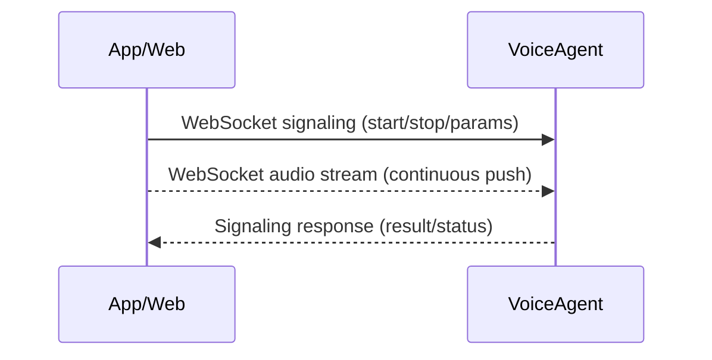
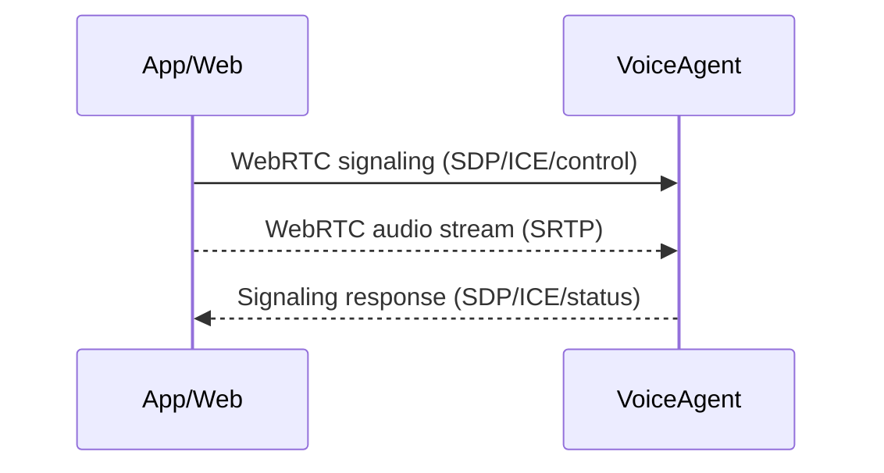
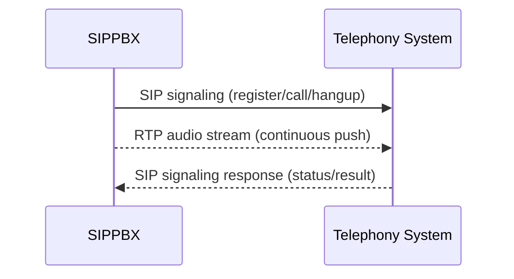
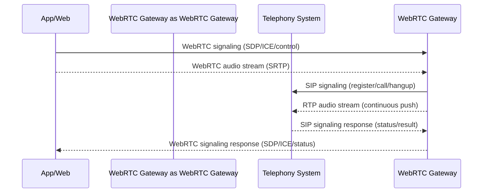

# VoiceAgent Integration with Telephony Networks: Technical Overview

## 1. Voice Streaming over WebSocket
**Sequence Diagram:**

Signaling and audio streams are both delivered over WebSocket.

**Key Points:**
- Simple and reliable; lightweight architecture, easy to implement and deploy.
- Limited jitter resilience; NAT traversal is reasonable, but performance may degrade on unstable networks.
- Signaling is straightforward and can be RESTful.

**Representative Solutions:**
- [Xiaozhi: An MCP-based Chatbot](https://github.com/78/xiaozhi-esp32)
- [Pipecat: Real-Time Voice & Multimodal AI Agents](https://github.com/pipecat-ai/pipecat)

## 2. WebRTC Protocol
**Key Points:**
- Protocol is complex, requiring STUN/TURN servers and multiple network components.
- Native browser support with advanced audio features (noise suppression, echo cancellation).
- Excellent jitter resilience; signaling is flexible and customizable, ideal for internet-based applications.
- **Security Requirement**: Browsers require WebRTC to be used in a Secure Context (**HTTPS** or **127.0.0.1**).

**Sequence Diagram:**

Signaling is customizable; audio streams are transmitted via WebRTC.

**Representative Solutions:**
- [Ten-Framework: Open-source framework for conversational voice AI agents.](https://github.com/TEN-framework/ten-framework)
- [Pipecat: Real-Time Voice & Multimodal AI Agents](https://github.com/pipecat-ai/pipecat)
- [LiveKit: Real-time video, audio and data for developers](https://github.com/livekit/livekit)

## 3. SIP/RTP Protocol
**Key Points:**
- Fully interoperable with legacy telephony systems; standardized and highly compatible.
- Signaling is complex and process-driven, suitable for enterprise and carrier-grade deployments.
- Outstanding jitter resilience.

**Sequence Diagram:**

Signaling is handled via SIP; audio streams use RTP.

**Popular SIP PBX Solutions:**
- [FreeSwitch: Software Defined Telecom Stack](https://github.com/signalwire/freeswitch)

FreeSwitch is a widely adopted open-source platform for telephony integration. It powers many enterprise-grade gateways and solutions, offering robust SIP/RTP support and scalability. The project is mature, actively maintained, and features a codebase exceeding 1.8 million lines.

## 4. WebRTC Gateway Interoperability Workflow
WebRTC gateways serve as middleware, bridging WebRTC and SIP/RTP networks:

**Sequence Diagram:**

1. App/Web clients retain WebRTC advantages (native browser, noise reduction, echo cancellation, jitter resilience).
2. The gateway performs protocol conversion, mapping WebRTC signaling and media streams to SIP/RTP standards for telephony integration.
3. Enables seamless connectivity between internet and telephony networks.

**Key Challenges:**
1. Audio format conversion and resampling are CPU-intensive.
2. High concurrency requirements; traditional thread-based architectures may struggle to scale.
3. Beyond simple forwarding—built-in VAD, noise reduction, ASR, and TTS capabilities simplify application development.

**Representative Solutions:**
- [Janus: the general purpose WebRTC server](https://janus.conf.meetecho.com/)
- [RustPBX: AI-Powered Software-Defined PBX](https://github.com/restsend/rustpbx)

## Solution Comparison

| Solution     | Signaling Complexity | Standardization | Jitter Resilience | Notes |
|--------------|---------------------|----------------|-------------------|-------|
| WebSocket    | Low                 | None           | Weak              | Simple implementation, best for lightweight scenarios |
| WebRTC       | Low                 | None           | Strong            | Native browser support, advanced audio features |
| SIP/RTP      | High                | Yes            | Strong            | Industry standard, highly compatible |

**Recommended Use Cases:**
- WebSocket: LAN, IoT, simple voice dialogs
- WebRTC: Internet voice, smart customer service, conversational AI
- SIP/RTP: Enterprise communications, carrier networks, telephony gateways

For App/Web integration, WebRTC is generally preferred. Interworking with telephony systems requires a gateway for protocol conversion.

## About RustPBX
RustPBX was officially launched on February 14, 2025. Prior to this, we developed a SIP protocol stack in Rust (December 4, 2024):

- [rsipstack: A SIP Stack written in Rust](https://github.com/restsend/rsipstack)

RustPBX is designed to be a modern, AI-native replacement for FreeSwitch, with a focus on security and agent-centric features:
- Built-in audio algorithms: VAD, noise reduction, WAV/MP3 playback, recording, CDR
- Native support for ASR/LLM/TTS pipelines, direct cloud integration without MRCP
- Integrated WebRTC and SIP/RTP—no third-party gateway required (effectively Janus + FreeSwitch in one)
- Coroutine-based architecture: a single core can handle 160 concurrent voice channels (VAD + noise reduction + recording)
