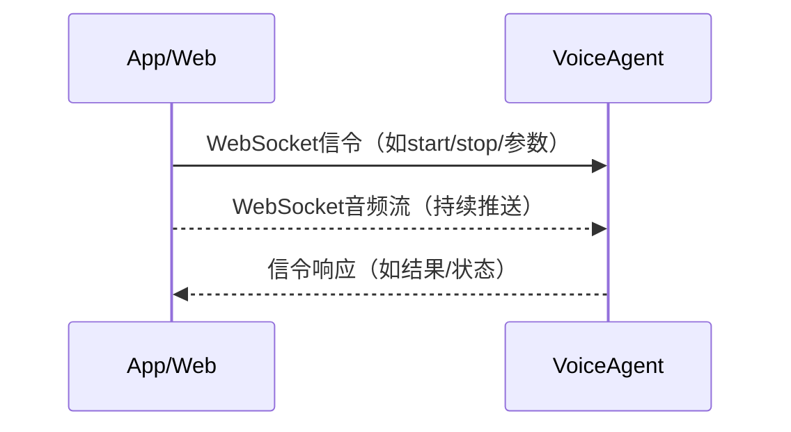
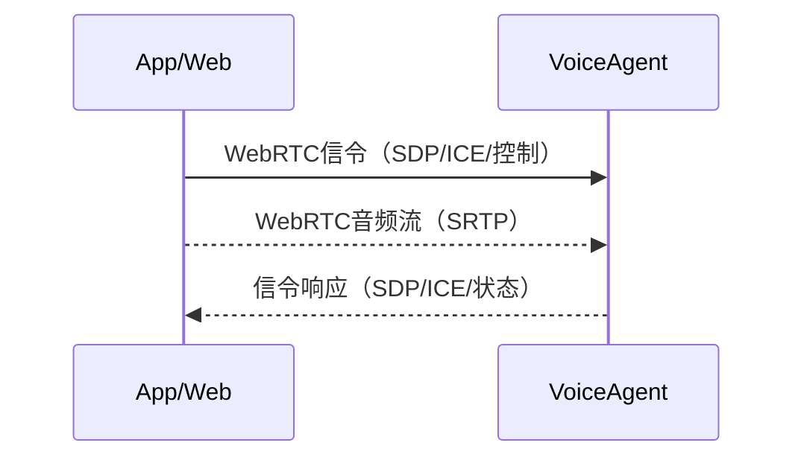
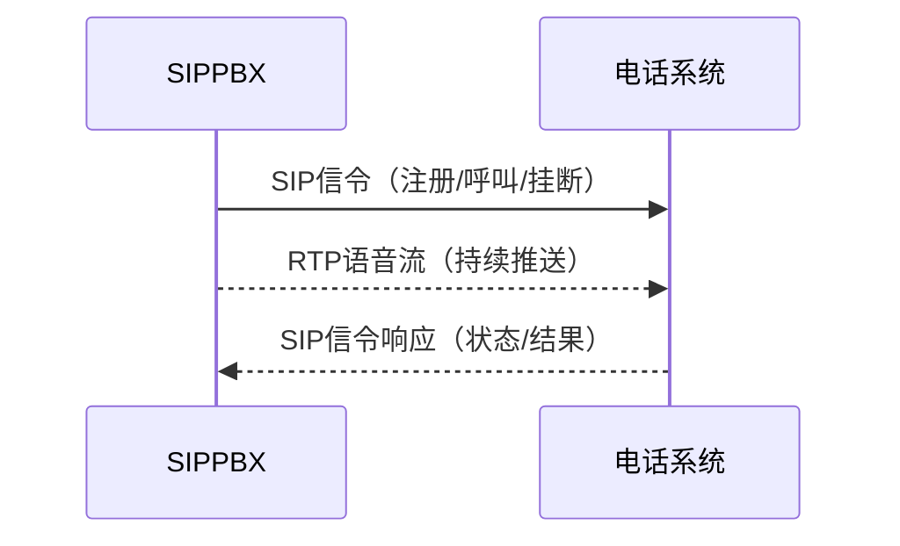
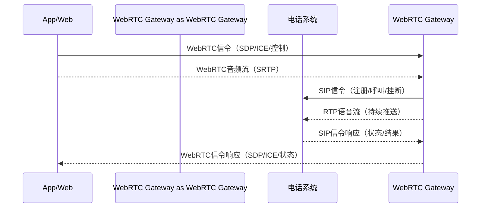

# VoiceAgent 与电话网络互通的技术实现

## 1. WebSocket传送语音流
**时序图**：

信令和语音流均通过WebSocket传输。

**特点**：
- 简单可靠，网络架构简单，易于实现。
- 不具备抗网络抖动能力，公网穿透好，容易出现卡顿
- 信令简单，基于RESTful就可以

典型的产品：
 - [小智: An MCP-based Chatbot](https://github.com/78/xiaozhi-esp32)
 - [Pipecat: Real-Time Voice & Multimodal AI Agents](https://github.com/pipecat-ai/pipecat)
 

## 2. WebRTC协议
**特点**：
- 协议复杂，需要STUN/TURN服务器等多个网络部件。
- 浏览器原生支持，具备优秀的声音处理能力（降噪、回声消除等）。
- 抗网络抖动能力强，信令可自由制定，适合互联网场景。
- **安全性要求**：浏览器要求 WebRTC 必须在安全上下文（Secure Context）中使用（HTTPS 或 127.0.0.1）。

**时序图**：

信令可自定义，语音流通过WebRTC传输。

典型的产品：
 - [Ten-Framework: Open-source framework for conversational voice AI agents.](https://github.com/TEN-framework/ten-framework)
 - [Pipecat: Real-Time Voice & Multimodal AI Agents](https://github.com/pipecat-ai/pipecat)
 - [LiveKit: Real-time video, audio and data for developers](https://github.com/livekit/livekit)

## 3. SIP/RTP协议
**特点**：
- 与传统电话网络系统对接，标准规范，兼容性好。
- 信令复杂，流程规范，适合企业级和运营商级应用。
- 具备良好的抗网络抖动能力。

**时序图**：

信令通过SIP协议，语音流通过RTP协议传输。

主流的SIPPBX产品：
- [FreeSwitch is a Software Defined Telecom Stack](https://github.com/signalwire/freeswitch)

FreeSwitch是一个非常优秀的产品，大部分与电话对接的智能网关都是基于FreeSwitch来做
loc: 180万行

## 4. WebRTC网关的互联互通工作流程
WebRTC网关作为中间件，实现WebRTC与SIP/RTP的互联互通：

**时序图**：

1. App/Web端保留WebRTC的优势（浏览器原生、降噪、回声消除、抗抖动）。
2. Gateway负责协议转换，将WebRTC的信令和语音流转换为SIP/RTP标准，与电话系统对接。
3. 实现互联网与电话网络的无缝连接。

挑战：
1. 音频格式的转换、重采样消耗CPU
2. 并发压力大，传统线程架构比较难支持大量并发
3. 不能只做转发，VAD、降噪、ASR、TTS内置才能简化开发

典型的产品：
 - [Janus: the general purpose WebRTC server](https://janus.conf.meetecho.com/)
 - [RustPBX: AI-Powered Software-Defined PBX](https://github.com/restsend/rustpbx)

## 总结

| 方案         | 信令复杂度 | 信令标准化 | 抗抖动 | 备注 |
|--------------|------------|--------|--------|------|
| WebSocket    | 低         | 无     | 弱     | 实现简单，适合轻量场景 |
| WebRTC       | 低         | 无     | 强     | 浏览器原生，音频处理好 |
| SIP/RTP      | 高         | 有     | 强     | 电话系统标准，兼容性好 |

App/Web接入仍然首选WebRTC，但是如果要与电话系统对接，就必须有转换网关

## About RustPBX
RustPBX是2025年2月14正式启动，在之前我们还基于Rust实现了一个sip协议栈(2024.12.04)

- [rsipstack: A SIP Stack written in Rust](https://github.com/restsend/rsipstack)

RustPBX目标是替代FreeSwitch, 更安全并且Ai native， 面向Agent的技术特点：
- 内置音频常用算法：VAD、降噪、Wav/Mp3播放、录音、CDR
- ASR/LLM/TTS pipeline一等公民，无需MRCP就可以对接大部分云厂商
- WebRTC与SIP/RTP内置，不需要第三方网关，相当于Janus + FreeSwitch
- 协程性能更好：单核能支持160路语音（VAD+降噪+录音）
